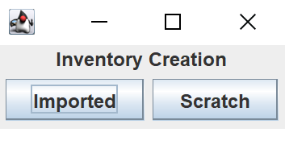

## Introduction
Group #60 proudly presents "Invenricky", an inventory system that is tailored for business use. 

### Getting Started / Importing
Upon starting the program, the user will have the option to import an inventory or create an inventory from Scratch.
In both cases, the user will be prompted to enter a name for their inventory, but the imported option will also require the user to choose a serializable file to import from.
An inventory created from scratch will be completely blank and not include an items or orders, while an imported inventory will be populated based on the data of the imported serializable file.
From this point, all inventories will have the same functionalities, as described further in the document.

### Exporting
a

___

### Orders
Orders are a subclass of Items along with InventoryItems, but serve a different purpose. Orders keep track of all the attributes of InventoryItems but also keep track of ___.
When an order is received, the user can mark it as received on the Orders UI which will mark the order as received on the Orders table and add the item to the InventoryUI.

### Inventory Items
InventoryItems are the Items displayed in the InventoryUI, and represents all the items currently stored in the inventory.
These InventoryItems can be increased in quantity or sold.

___

### Analysis
Analysis generates a financial report of the inventory. ___

___

### Search / Sort / Filter
The default order of the items in InventoryUI is based on the order in which the items were added to the inventory.
If the user would like to reorder the items or search for a specific subsection of items, they can use the search, sort, or filter options.
__

